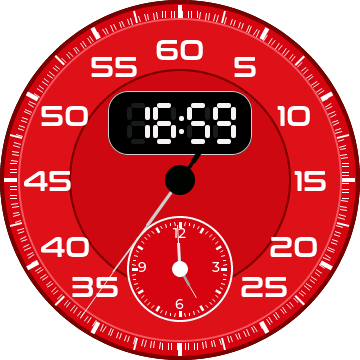
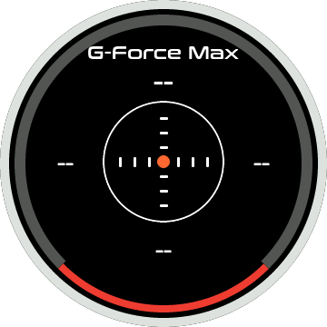
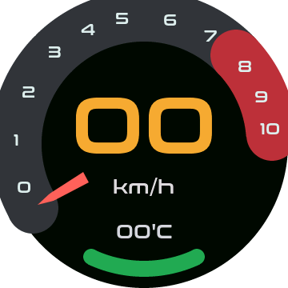
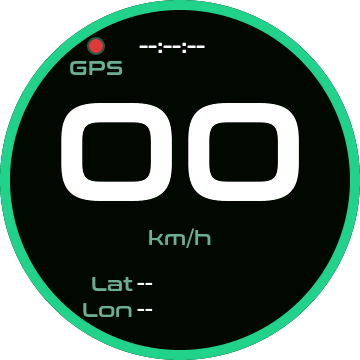
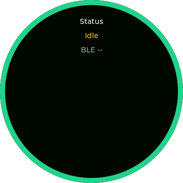
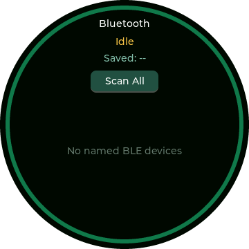

# ESP32-S3 OBD HUD Firmware

这是 ESP32-S3 OBD HUD 固件工程，基于 ESP-IDF 和 LVGL，目标芯片为 ESP32-S3。

## 当前功能

- ESP-IDF 工程入口
- ST77916 LCD 初始化
- LVGL 基础显示循环
- 开机 Logo PNG 资源
- 蓝牙 OBD 设备扫描、选择和连接
- OBD 数据解析与仪表页面显示
- OBD 运行时数据缓存，RPM / speed 平滑输出
- Dashboard 圆弧式仪表 UI，底部水温弧支持高温变色
- Clock 时钟页面
- IMU / G-Force Max 页面
- GPS UART 状态页面
- GPS UART 大号速度显示，使用真实大字号字体渲染
- GPS UART 状态点带 `GPS` 小字注释，便于识别当前状态指示
- PCF85063 RTC 驱动
- QMI8658 六轴驱动
- WiFi + NTP 校时支持

## 环境

本机 ESP-IDF 路径：

```bash
/Users/bk/.espressif/v5.5.4/esp-idf
```

普通 shell 默认没有加载 `idf.py`，构建前需要先激活 ESP-IDF：

```bash
source /Users/bk/.espressif/v5.5.4/esp-idf/export.sh
```

已验证版本：

```text
ESP-IDF v5.5.4
Python 3.13.14
```

## 配置状态

- 目标芯片：`esp32s3`
- Flash：`16MB`
- 分区表：`partitions.csv`
- LVGL：16-bit color，启用 byte swap
- Bluetooth：启用 NimBLE，未启用 Bluedroid
- PSRAM：本项目目前没有需要 PSRAM 的场景，默认不启用
- WiFi/NTP：功能已接入，默认未配置 SSID，不会主动联网

PSRAM 相关配置保持关闭：

```text
# CONFIG_SPIRAM is not set
# CONFIG_ESP32S3_SPIRAM_SUPPORT is not set
```

## Build

```bash
source /Users/bk/.espressif/v5.5.4/esp-idf/export.sh
idf.py build
```

生成固件：

```text
build/esp32s3_obd.bin
```

## 页面操作

- 开机 Logo 自动进入 Clock 页面。
- Clock / IMU / Dashboard / GPS UART / OBD Details 支持左/右滑循环切换。
- OBD Details 上滑进入 Bluetooth。
- Clock 上/下滑切换主题；双击进入小时/分钟设置；设置模式下上/下滑调整时间。
- IMU 双击复位校正；每次进入 IMU 页面也会自动复位校正。
- Bluetooth 右滑返回 OBD Details；连接成功后自动回到 Dashboard。
- OBD Details 使用与 GPS UART 同款绿色外圈。

## Newfeatures 移植内容

已从 `../project01_newfeatures` 移植：

- `Clock / IMU / UART` 页面
- `PCF85063` RTC 驱动
- `QMI8658` 六轴驱动
- GPS UART 接收与 NMEA/UBX 解析
- WiFi/NTP 到 RTC 的校时逻辑
- 页面字体资源
- `FontTypoderSize140` 大号数字字体，用于 GPS UART 速度显示

WiFi/NTP 默认不启用。需要联网校时时，在构建前给 `NEWFEATURES_WIFI_SSID` 和
`NEWFEATURES_WIFI_PASS` 提供非空值，或后续改成 menuconfig 配置项。

## OBD Cache 移植内容

已从 `../project02_bd_gauge` 移植 OBD runtime cache：

- 新增 `components/esp32s3_obd/obd_data_cache.c`
- 新增 `components/esp32s3_obd/obd_data_cache.h`
- BLE OBD PID 解析成功后写入 cache
- `obd_ble_get_snapshot()` 返回时从 cache 读取数据
- RPM / speed getter 使用动态一阶滤波，显示数值平滑但大变化时更快跟随
- 冷却液温度、进气温度、发动机负荷、TPS、电压、油量、机油温进入统一 cache
- BLE 新连接开始时清空 cache，避免上一次连接的数据残留

未移植 `project02_bd_gauge` 中依赖 `nvs_storage` 的里程统计任务；当前工程暂只接入实时 OBD 数据缓存。

### OBD Cache 响应优化

更新时间：`2026-06-19 22:06:34 CST`

- RPM / speed 平滑时间常数下调，并增加大跳变快速跟随逻辑，减少仪表滞后感。
- cache 清空时同步重置平滑状态，避免新连接后沿用上一辆车或上一次连接的旧平滑值。
- OBD 轮询节奏更偏向 speed / RPM，非关键 PID 改为慢速轮询，提升实时数据刷新感。

## Dashboard UI

- Dashboard 使用圆弧式仪表布局：顶部/右侧大圆弧表示 RPM 区域，右侧红色段表示高转速区。
- RPM 数字 `0-10` 布置在大圆弧带上。
- RPM 使用平滑后的 cache 数据驱动红色楔形指针，指针按 `0-10000 RPM` 映射到大圆弧对应位置。
- 速度使用 `FontTypoderSize100` 大号数字居中显示，下方显示 `km/h`。
- 底部小圆弧绑定 OBD 冷却液温度：水温 `> 95°C` 时变红，水温 `<= 95°C` 或暂无数据时保持绿色。
- 水温数字显示在底部小圆弧附近，无数据时显示 `00'C`。

## Flash

```bash
source /Users/bk/.espressif/v5.5.4/esp-idf/export.sh
idf.py -p PORT flash monitor
```

将 `PORT` 替换为实际串口设备。

## UI 截图

更新时间：`2026-06-20 00:01:44 CST`

本项目提供本地 LVGL 截图工具，直接复用固件里的 UI、字体、Logo 和 LVGL 绘制源码，按 `360 x 360` 生成每个界面的 PNG：

```bash
make -C tools/screenshots screenshots
```

输出目录：

```text
tools/screenshots/out/
```

当前生成页面：

- `01_logo.png`
- `02_clock.png`
- `03_imu.png`
- `04_dashboard.png`
- `05_gps_uart.png`
- `06_obd_details.png`
- `07_bluetooth.png`

截图工具使用默认无 OBD / GPS / IMU 数据状态；烧录后如接入实时数据，动态文字、指针和状态颜色会随真实数据变化。

## Clock 静态底图优化

更新时间：`2026-06-20 16:48:24 CST`

- Clock 页面静态表盘、刻度、外圈文字和小表盘改为离线生成的 LVGL 图片底图，运行时只继续渲染时间数字、设置标记、指针和中心轴等动态层。
- 底图由现有 Clock LVGL 绘制路径生成，不手工重画 UI，保持与原始对象绘制一致。
- 截图工具增加固定时间模式，可用旧完整绘制路径和新底图路径做逐字节比较；当前 Clock 固定时间截图已验证 `0 diff`。
- 由于 LVGL heap 仅 `64KB`，未采用运行时全屏 snapshot；底图资产放入 flash，避免额外占用大块 RAM。

## IMU 静态底图优化

更新时间：`2026-06-20 16:54:58 CST`

- IMU 页面静态黑底、外圈、G-Force 圆弧/刻度和标题改为离线生成的 LVGL 图片底图。
- 运行时仍继续渲染 G 值数字和橙色 G-force 点，保持传感器数据实时更新。
- 底图由原 IMU LVGL 静态绘制路径生成；固定截图下旧完整绘制路径与新底图路径已验证逐字节 `0 diff`。

## 近期修复

- 修复蓝牙页面点击 `scan all` 后触发 `ble_scan_restart` 栈溢出重启的问题。
- `ble_scan_restart` 任务栈从 `2048` 调整为 `4096`。
- 扫描重启任务创建失败时会清理 pending 状态，避免扫描状态卡住。
- 从 `project01_newfeatures` 移植 Clock、IMU、GPS UART、RTC、NTP 校时等功能。
- 从 `project02_bd_gauge` 移植 OBD runtime cache，Dashboard 速度/RPM 读取平滑后的缓存值。
- Dashboard 速度数字改为和 RPM / TEMP 一样的固定宽度居中 label 渲染。
- GPS UART 页面速度数字改用真实 `FontTypoderSize140` 大字号字体，避免 `transform_zoom` 导致不渲染。
- GPS UART 速度无数据时显示 `00`，避免大字号数字字体缺少 `-` 时出现缺字方框。
- 页面顺序调整为 Clock / IMU / Dashboard / GPS UART / OBD Details。
- 蓝牙入口从 Dashboard 上滑改为 OBD Details 上滑，Bluetooth 右滑返回 OBD Details。
- Dashboard 大圆弧加宽并改为实色显示，RPM 数字居中落在圆弧带上。
- Dashboard 底部小圆弧与冷却液温度绑定，水温超过 `95°C` 时变红。
- Dashboard RPM 指针改为尾粗前尖的红色楔形多边形，由平滑后的 RPM cache 数据驱动。
- 2026-06-19 22:06:34 CST：优化 OBD cache 响应速度，动态平滑 speed/RPM，并提高 speed/RPM 轮询优先级。
- 2026-06-19 22:14:42 CST：新增本地 LVGL 全界面截图工具，输出 7 张 `360 x 360` PNG，用于对照烧录后显示。
- 2026-06-20 00:01:44 CST：Bluetooth 页面外圈改为与 GPS UART 页面一致的绿色外圈，并刷新对应截图。
- 2026-06-20 16:48:24 CST：Clock 页面静态表盘改为离线生成底图，固定时间截图与旧绘制路径逐字节 `0 diff`。
- 2026-06-20 16:54:58 CST：IMU 页面静态层改为离线生成底图，固定时间截图与旧绘制路径逐字节 `0 diff`。
- 2026-06-20 17:01:01 CST：GPS UART 页面状态点下方新增 `GPS` 小字注释，并刷新对应截图。
